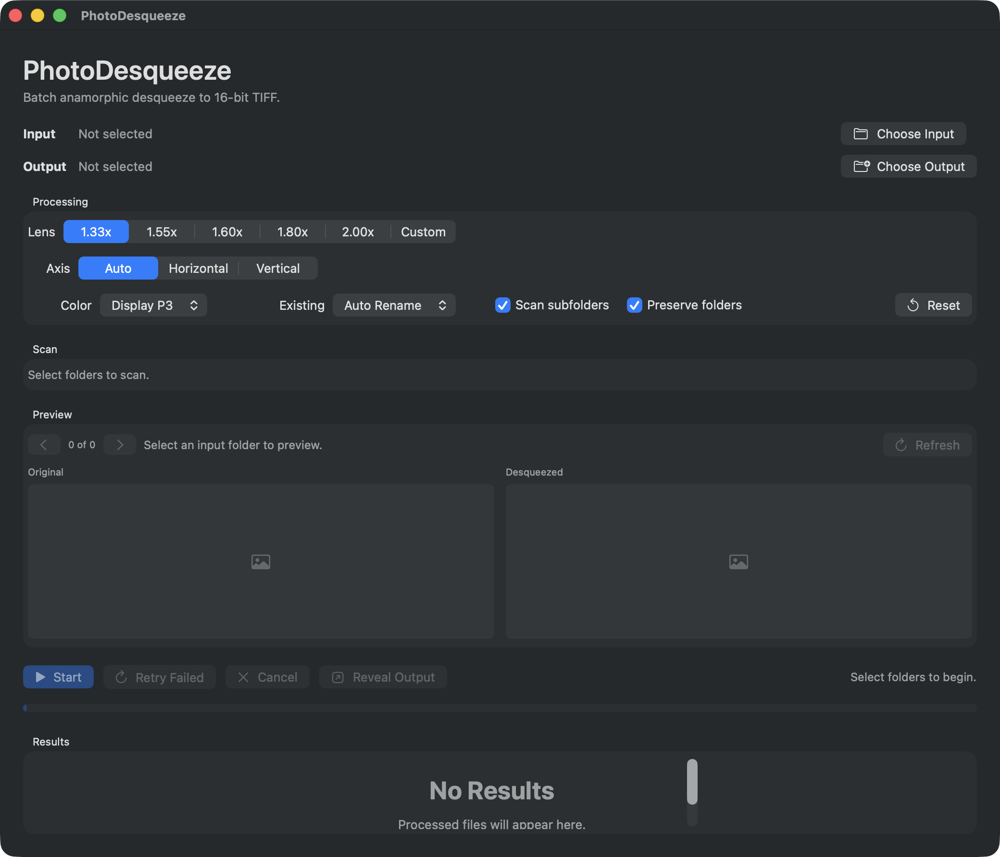

# PhotoDesqueeze

PhotoDesqueeze is a native macOS SwiftUI app for batch anamorphic desqueeze.
It reads a folder of RAW or rendered images, stretches width by the selected
lens factor, and writes practical editing masters as 16-bit TIFF files.



The intended workflow is:

1. Keep original RAW files untouched.
2. Select the source folder in PhotoDesqueeze.
3. Select an output folder.
4. Choose the lens factor, usually `1.33x`, `1.55x`, `1.60x`, `1.80x`, or `2.00x`.
5. Process to 16-bit TIFF.
6. Edit the TIFFs in Photomator, Pixelmator Pro, Lightroom, Capture One, or another editor.

## Why TIFF, not RAW?

An anamorphic desqueeze changes the rendered geometry of an image. After that
operation the result is no longer the camera's original RAW sensor data. This
app keeps RAW originals untouched and creates high-quality 16-bit TIFF files as
editable masters.

## Features

- Native macOS SwiftUI app target.
- Folder input and folder output.
- RAW-first loading through Apple's Core Image RAW pipeline.
- Fallback support for common rendered formats supported by macOS, including TIFF, JPEG, PNG, HEIC/HEIF, and WebP.
- Batch processing with progress, cancellation, retry-failed, and structured per-file results.
- Side-by-side preview with previous/next navigation through scanned images.
- Preflight scan summary with RAW/rendered counts and planned write/rename/overwrite/skip counts.
- Built-in anamorphic presets plus custom factors.
- Inline custom factor validation with dot and comma decimal support.
- Automatic horizontal/vertical desqueeze axis selection with manual overrides.
- Visible auto-axis resolution and warning when portrait dimensions are used without orientation metadata.
- 16-bit/channel TIFF export.
- Display P3 or sRGB output color space.
- Optional recursive folder scanning.
- Optional preservation of input subfolder structure.
- Existing-file handling: auto-rename, overwrite, or skip.
- Atomic TIFF writes, so incomplete temp files are not promoted to final output.
- Partial safe metadata preservation for TIFF/EXIF camera fields.
- CSV manifest written to the output folder after each batch.
- Result filtering, reveal actions, and copy-error actions.
- Security-scoped folder bookmarks and saved processing settings.

## Build

Requirements:

- macOS with Xcode 26 or newer installed.
- Xcode command line tools selected with `xcode-select`.

Open the project:

```bash
open PhotoDesqueeze.xcodeproj
```

Run tests from Terminal:

```bash
xcodebuild test \
  -project PhotoDesqueeze.xcodeproj \
  -scheme PhotoDesqueeze \
  -destination 'platform=macOS' \
  -derivedDataPath /private/tmp/PhotoDesqueezeDerivedData
```

The GitHub Actions workflow runs the same test command on macOS.

## Download

Public builds are intended to ship through GitHub Releases as signed and
notarized `.zip` and `.dmg` artifacts. Download the latest release from:

https://github.com/cn0ss/PhotoDesqueeze/releases

If no release is published yet, build locally from Xcode or wait for the first
tagged Developer ID release.

## Signing

The app target uses bundle identifier `dev.niklasschmidt.PhotoDesqueeze`, and
the test target uses `dev.niklasschmidt.PhotoDesqueezeTests`. The project is
configured for manual signing without a committed `DEVELOPMENT_TEAM`, certificate,
provisioning profile, or private key. Choose a local signing team in Xcode when
you want to archive or distribute a signed build.

## Implementation Notes

The processing path is intentionally simple and native:

- `NSOpenPanel` selects input and output folders.
- App Sandbox uses user-selected read/write file access, with security-scoped
  bookmarks for restored folders.
- `UTType` and fallback RAW extensions identify candidate images.
- A preflight pass plans output paths without rendering images.
- `CIRAWFilter` opens RAW files supported by macOS.
- `CIImage(contentsOf:options:)` opens rendered image formats and applies orientation metadata.
- `CILanczosScaleTransform` performs high-quality scaling. Landscape files are stretched horizontally; 90-degree rotated or portrait files can be stretched vertically.
- `CIContext.writeTIFFRepresentation` writes the rendered output as `.RGBA16`
  TIFF in the selected RGB color space.
- Output is written through a temporary file and moved into place after render
  succeeds.

More detail is in [Docs/Research.md](Docs/Research.md).

## Release

Release signing and notarization are documented in:

- [Docs/Signing.md](Docs/Signing.md)
- [Docs/Release.md](Docs/Release.md)

The release workflow uses Developer ID signing and Apple's `notarytool`. Signing
certificates, App Store Connect API keys, team IDs, and provisioning profiles
must be configured as GitHub secrets or local environment values, never committed
to this repository.

## Current Limitations

- RAW support depends on Apple's RAW decoders and the camera models supported by the installed macOS version.
- Output is a rendered 16-bit TIFF, not a new RAW file.
- Metadata copying is intentionally conservative. TIFF/EXIF camera fields are
  copied when Image I/O exposes them, while geometry-sensitive orientation data
  is removed from the destination.
- Automatic axis detection uses orientation metadata first, then image dimensions as a fallback.
- Preview navigation uses the scanned file list, not per-file axis overrides.
- Processing is sequential to avoid memory spikes with large RAW batches.

## References

- Apple Image I/O overview: https://developer.apple.com/documentation/imageio
- Apple `CIRAWFilter`: https://developer.apple.com/documentation/coreimage/cirawfilter
- Apple `CIContext.writeTIFFRepresentation`: https://developer.apple.com/documentation/coreimage/cicontext/1642213-writetiffrepresentation
- Apple `CILanczosScaleTransform`: https://developer.apple.com/documentation/coreimage/cifilter/3228344-lanczosscaletransform
- Apple App Sandbox file access: https://developer.apple.com/documentation/security/app_sandbox/accessing_files_from_the_macos_app_sandbox
